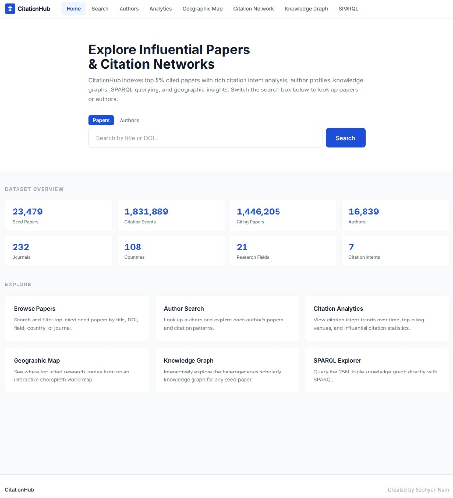

# CitationHub



**CitationHub** is an interactive exploration system built on **IDCite**, a large-scale multidisciplinary citation-event dataset. It lets readers search influential seed papers and authors, inspect citation intents and contexts, and explore geographic, network, and knowledge-graph views of the same underlying resource.

**Website URL:** [https://citation-hub-website.vercel.app](https://citation-hub-website.vercel.app)

This repository explains how CitationHub is organized and how it uses IDCite. It is written for readers who want to understand the system, not to rebuild or redeploy it.

---

## System Overview

The home page is the entry point to the system.

- The **top navigation** lists eight modules: Home, Search, Authors, Analytics, Geographic Map, Citation Network, Knowledge Graph, and SPARQL.
- The **hero search box** switches between Papers (title or DOI) and Authors.
- **Dataset Overview** reports the scale currently served by the interactive system (seed papers, citation events, citing papers, authors, journals, countries, fields, and citation intents).
- **Explore** links to the six analysis modules.

The numbers on the home page describe the live index. The full IDCite release is larger and is documented in [Data layer](#data-layer-idcite).

---

## Features

Each navigation tab is a separate view over the same IDCite tables.

### Home

The landing page introduces the corpus, provides paper/author search, and summarizes dataset scale. The Explore cards jump to Search, Authors, Analytics, Geographic Map, Knowledge Graph, and SPARQL.

### Search

Keyword search over seed-paper titles and DOIs, with Field, Country, and Journal filters, pagination, and CSV export. Opening a result leads to the **paper detail** page.

### Authors

Author-name search grouped by author identifier. Each card shows affiliation, country, primary field, seed-paper count, and total citations. Opening a card leads to the **author detail** page: profile metadata, seed papers, citation-intent distribution, citations over time, and top citing venues.

### Analytics

Global statistics across citation events:

- citation-intent distribution
- share of citations marked influential
- intent trends by year
- top citing venues

### Geographic Map

A world map of seed-paper counts with three switchable layers — **by country** (choropleth), **by city**, and **by affiliation** (bubbles sized by paper count, labelled automatically). Ranked lists of top countries, cities, and affiliations sit under the map. IDCite names cities and affiliations but carries no coordinates; CitationHub places them with a GeoNames lookup shipped with the application.

### Citation Network

A force-directed network for a selected seed paper. Citing papers are nodes colored by primary citation intent (`background`, `uses`, `similarities`, `motivation`, `differences`, `future_work`, `extends`). Drag to pan, scroll to zoom, and click a node for details.

### Knowledge Graph

A heterogeneous graph around a seed paper: papers, citation events, authors, journals, affiliations, cities, countries, fields, and intents. A second tab, **Citation Event Schema**, shows the class/relation diagram used by the graph and SPARQL views.

### SPARQL

A read-only SPARQL explorer over the RDF knowledge graph (about 25 million triples). Users can run prepared example queries or write SELECT / ASK / CONSTRUCT / DESCRIBE queries, inspect an ontology panel, and download results as CSV. Write operations are not allowed.

### Paper detail

Not a navigation tab, but reachable from Search, Citation Network, and Knowledge Graph. It shows bibliographic metadata, intent distribution, citing papers, co-cited papers, citation-context snippets, a knowledge-graph shortcut, and CSV export of that paper’s citation events.

More screen-level detail is in [`docs/features.md`](docs/features.md).

---

## Data layer: IDCite

CitationHub is the application layer. **IDCite** is the data layer: 17 Apache Parquet tables of citation events, publication metadata, normalized scholarly entities, and a supplementary knowledge graph.

| Measure (IDCite release) | Value |
|---|---|
| Citation events | 1,857,503 |
| Citing papers | 1,467,045 |
| Seed (cited) papers | 23,479 |
| ESI fields | 21 |
| Q1 journals in the sampling frame | 105 |
| Knowledge-graph nodes / edges | 3,418,433 / 6,855,117 |
| Data snapshot | November 2025 |

The interactive system reads a working subset of those tables (normalized seed papers, normalized citation events, the author lookup, and the knowledge-graph node/edge files). Geographic Map uses city, country, and affiliation names already on the seed-paper table, plus a separate coordinate lookup derived from GeoNames — not from IDCite. The remaining tables are part of the public dataset release.

**Where to get the 17 Parquet files**

| Resource | Location |
|---|---|
| IDCite Version 3 (Zenodo) | [https://doi.org/10.5281/zenodo.20796923](https://doi.org/10.5281/zenodo.20796923) |
| Processed dataset mirror (Hugging Face) | [https://huggingface.co/datasets/Daniel0315/IDCite](https://huggingface.co/datasets/Daniel0315/IDCite) |
| Dataset Construction pipeline | [https://github.com/SeohyunNam/MDCite](https://github.com/SeohyunNam/MDCite) |

File-by-file inventory and schemas: [`docs/data.md`](docs/data.md).

---

## System Architecture

CitationHub separates the public interface from the data and query services.

```
Browser
   │
   ▼
Next.js frontend  (search, analytics, maps, graphs, SPARQL editor)
   │  HTTPS API
   ▼
FastAPI backend
   ├── Parquet tables   (pandas / DuckDB)
   └── read-only SPARQL proxy
            │
            ▼
       SPARQL engine (QLever) serving the RDF knowledge graph
```

- The **frontend** is a Next.js application: paper/author search, charts, a world map (country choropleth plus city and affiliation bubbles), force graphs, and the SPARQL editor.
- The **backend** loads IDCite Parquet files and answers overview, search, paper, author, analytics, geo, and knowledge-graph requests.
- The **RDF layer** is produced from `kg_nodes.parquet` and `kg_edges.parquet`. QLever indexes those triples; the backend forwards read-only SPARQL queries and rejects update operations.

This repository does not include deployment hostnames, internal paths, or credentials. Logical design is in [`docs/architecture.md`](docs/architecture.md).

---

## SPARQL and QLever

The SPARQL page queries a scholarly RDF graph with namespaces:

- resources: `http://citationhub.org/id/`
- ontology: `http://citationhub.org/ontology/` (`ch:`)

**Classes:** SeedPaper, CitingPaper, CitationEvent, Author, Journal, Affiliation, City, Country, Field, Intent

**Relations:** hasAuthor, hasAffiliation, belongsToField, publishedIn, publishedInVenue, locatedInCity, locatedInCountry, hasCitedPaper, hasCitingPaper, hasPrimaryIntent

The SPARQL engine is **QLever**. Example queries: [`examples/sparql/`](examples/sparql/). Ontology notes and references: [`docs/sparql.md`](docs/sparql.md).

---

## Related resources

- **CitationHub system:** [https://citation-hub-website.vercel.app](https://citation-hub-website.vercel.app)
- **IDCite construction pipeline:** [https://github.com/SeohyunNam/MDCite](https://github.com/SeohyunNam/MDCite)
- **IDCite dataset (Zenodo v3):** [https://doi.org/10.5281/zenodo.20796923](https://doi.org/10.5281/zenodo.20796923)
- **IDCite mirror (Hugging Face):** [https://huggingface.co/datasets/Daniel0315/IDCite](https://huggingface.co/datasets/Daniel0315/IDCite)
- **IDCite project page:** [https://seohyunnam.github.io/IDCite-Website/](https://seohyunnam.github.io/IDCite-Website/)

---

## Creator

Seohyun Nam, Department of Computer Engineering, Chung-Ang University  
Seohyun0315@cau.ac.kr

---

## License

Documentation in this repository is licensed under [Creative Commons Attribution 4.0 International (CC BY 4.0)](https://creativecommons.org/licenses/by/4.0/). Reuse of IDCite itself follows the dataset license and the terms of the upstream scholarly sources.
